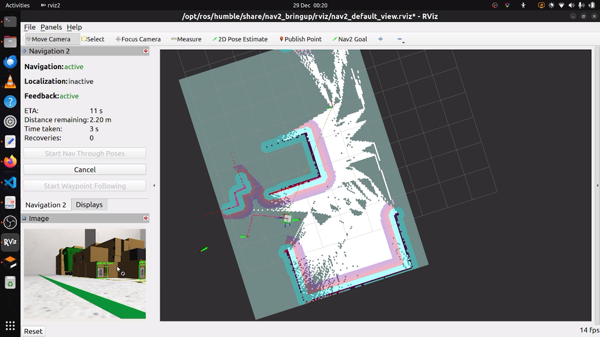

## ROS 2 package to demonstrate a warehouse inspection robot in gazebo simulation.

### Environment
<li>
OS:     Ubuntu 22.04.5 LTS
</li>
<li>
ROS2:   Humble Hawksbill
</li>
<li>
Gazebo: Gazebo, version 11.9
</li>

## Python requirements > version 3.10
ultralytics
cv2
cv2_bridge

### Installation instruction
git clone and cd into the repo directory
 ** source install/setup.bash **

### run the warehouse simulation with turtlebot3 
ros2 launch robot_bringup test.launch.py

### open another terminal to start navigation and rviz2
ros2 launcg turtlebot3_navigation navigation2.launch.py

### kill ros nodes if required
rpgrep -f "ros-args" | awk '{print "kill -9 " $1}' | sh

### if gazebo gives px!=0 error use
. /usr/share/gazebo/setup.sh

### save map
ros2 run nav2_map_server map_saver_cli -f ~/src/robot_bringup/map

### references to some resources used :
aws small warehouse [https://github.com/aws-robotics/aws-robomaker-small-warehouse-world]
turtlebot3 

